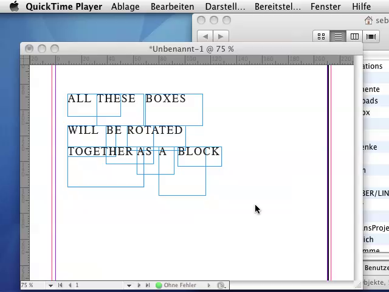

#RotateIndividuals

InDesign JSX Script Version 1.0 (2010-09-22)

Tested with InDesign CS4, CS5

---

####DEMO

[View on Vimeo](https://vimeo.com/sebastianberns/indd-rotate-individuals)

####INSTALLATION
Copy the folder *RotateIndividuals* to *Scripts/Scripts Panel* of your InDesign installation.

####HOW TO USE
In InDesign, select the object you want to rotate.
Open the scripts window and double click *RotateIndividuals.jsx*.